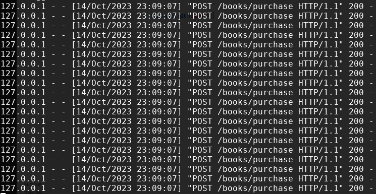
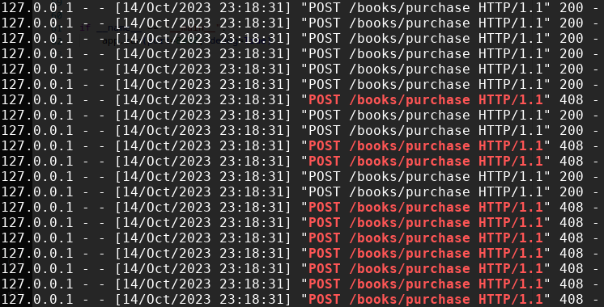
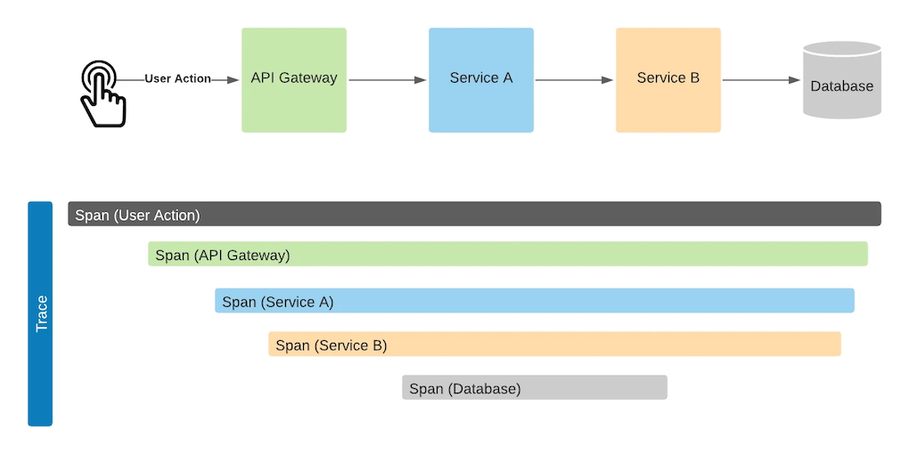
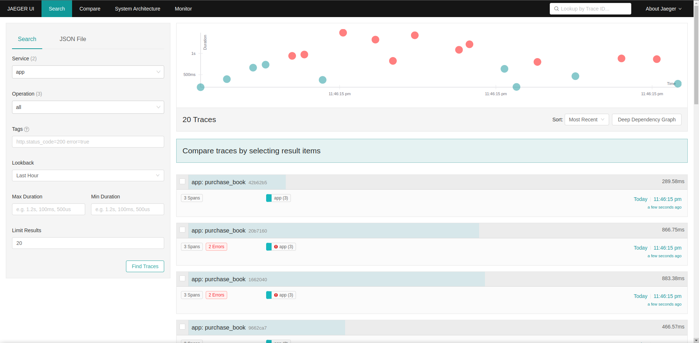
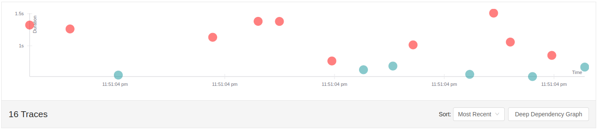
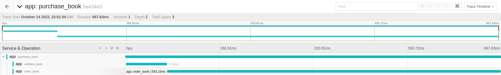
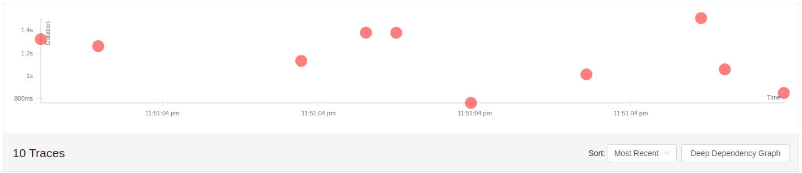
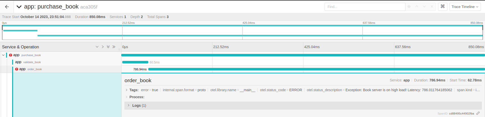

# Tracing your HTTP request

## Why do we need tracing?

Most of the days, we are seeing this on our screen



Everything seems fine, and HTTP 200 OK is everywhere

However, sometimes we also have a bad day when HTTP 408 Request Timeout is coming in



If we are not reacting fast enough, our day is getting worse when the VP slacks you "_What happened ?_"

In my cases, questions that often arise on an incident

- Who throws the exception?
- Who _delays_ the latency?

To answer them, we can rely on tracing!

## Tracing 101

Tracing consist of traces and span

Traces give us the big picture

A span represents a unit of work or operation



## Tracing implementation with Opentelemetry and Jaeger

In this hands-on we are going to use :

- Python
- OpenTelemetry -> To collect traces
- Jaeger -> As an UI to view and analyze traces

To see a full working demo see https://github.com/rafiramadhana/flask-otel

### Collecting Trace Data With Opentelemetry

OpenTelemetry (also referred to as OTel) is an open source observability framework made up of a collection of tools, APIs, and SDKs

#### Automatic

With automatic, we don't need to update our code. We only need to install some dependencies and run the flask app with a specific _launcher_

https://opentelemetry.io/docs/instrumentation/python/getting-started/#instrumentation

Install dependencies

```
pip install opentelemetry-distro

opentelemetry-bootstrap -a install
```

Run flask app

```
opentelemetry-instrument \
    --traces_exporter console \
    --metrics_exporter console \
    flask run -p 8080
```

#### Programmatic

With programmatic, we are updating our code a bit. We import a wrapper called `FlaskInstrumentor` and use it on our flask app

https://opentelemetry-python-contrib.readthedocs.io/en/latest/instrumentation/flask/flask.html

```
instrumentor = FlaskInstrumentor()

app = Flask(__name__)

instrumentor.instrument_app(app)
```

#### Manual

With manual, we are updating our code and having control on deciding what action to trace

https://opentelemetry.io/docs/instrumentation/python/manual/

```
tracer = get_tracer_provider().get_tracer(__name__)

def do_work():
    print("doing some work...")

def do_work_with_tracing():
    with tracer.start_as_current_span("do_work_with_tracing") as span:
        print("doing some work with tracing...")
```

### Analyzing Traces On Jaeger!

Once we've intergrated OpenTelemetry in our code, let's spawn our infra and run the stress test

```
make infra
make server
make stress
```

Our server is a Flask HTTP server, with 3 actions

- purchase_book
- validate_book
- order_book

Here is the very simplified version of the code

```
@app.post("/books/purchase")
def purchase_book():
    validate_book()
    order_book()


def validate_book():
    time.sleep(random.uniform(1, 100)/1000)


def order_book():
    t = random.uniform(100, 1500)
    time.sleep(t/1000)
    if t > 700:
        raise Exception("Book server is on high load! Latency: "+str(t))
```

To see the full code [main/app,py](https://github.com/rafiramadhana/flask-otel/blob/main/app.py)

Next, we are going to see Jaeger for traces (http://localhost:16686/search) to find out the incident's culprit



It looks like we have a lot of traces here. Let's do some filtering

#### Tracing requests with high latency

To filter traces with high latency we can set the `Min Duration` with `500ms`

It looks like request with duration more than 500ms are starting to have errors



Let's click on the trace to see the detail to see which span that spikes the latency



It looks like `order_book` has the longest duration

#### Tracing failed requests

To filter traces with errors we can set the `Tags` with `error=true`



Let's see the trace detail



It looks like `order_book` is throwing error `Book server is on high load!`. We are pretty sure that this incident is caused by latency spikes

Here, we are getting closer to the conclusion

Based on our analysis, we can say to our VP

"It looks like this incident is caused by latency spike in the `order_book` action"
